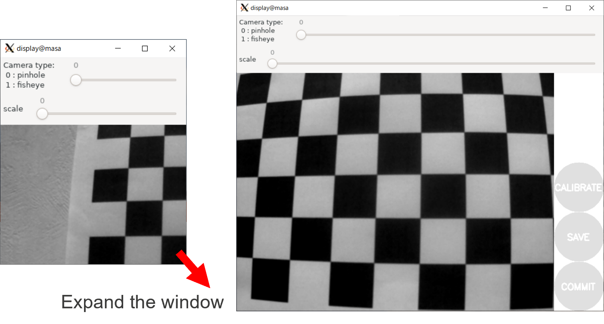

# RZ/V2H USB camera Calibration For VSLAM

## USB Camera Calibration environment

- In order to improve the accuracy of VSLAM, the camera needs to  be calibrated.<br>Calibrate the camera before running vslam application.

- (1) Connect the USB camera and Linux machine.
  
  Print the image data for calibration (chesspateern_7x10) and paste it on a board or wall

  

  | Equipment | Description |
  | ---- | ---- |
  | Linux host PC | <span style="color: red;">Ubuntu version 20.04 LTS</span> (64 bit OS must be used.) |
  | USB camera | ELP-USBGS720P02-L36 |
  | calibration pateern | calibration/chesspateern_7x10.pdf | 

- chesspateern_7x10 <br>
  


## Calibration instructions

- (2) Before starting the calibration, install docker and v4l2-ctl on the Linux Host PC.<br>&nbsp;&nbsp;&nbsp;&nbsp;&nbsp;&nbsp;v4l2-ctl<br>&nbsp;&nbsp;&nbsp;&nbsp;&nbsp;&nbsp;docker

    Install v4l-utils. (include v4l2-ctl)
    ```
    $ sudo apt install v4l-utils
    ```
    Install docker by referring to the website below. 
    https://docs.docker.com/engine/install/ubuntu/

- (3) Create a working directory($WORK) at the Linux Host PC and deploy these files in your work directory.
    - Script, Docker, Yaml file for Calibration of USB camera: <span style="color: red;">mono_usbcam_cal-2.3.0.tar.gz</span>
    
    Deploy these file as follows.
    The name and the place of the working directory can be changed as necessary.
    ```
    $ export WORK="/home/<username>/rzv_calibration"
    $ cd $WORK

    $ wget https://github.com/ComputermindCorp/yolo-planar-slam-drp/tree/main/calibration/mono_usbcam_cal-2.3.0.tar.gz
    $ tar zxvf mono_usbcam_cal-2.3.0.tar.gz
    ```

- (4) Check the usb camera by following command.
  
  Make sure the vendor's id is 32e4.
  ```
  $ lsusb | egrep Camera
  $ Bus 001 Device 002: ID 32e4:0144 Global Shutter Camera Global Shutter Camera
  ```

  Make sure /dev/video* displayed.
  ```
  $ v4l2-ctl --list-devices
  $ Global Shutter Camera: Global S (usb-0000:00:14.0-7):        
    /dev/video0        
    /dev/video1
  ```

  Execute the following command for /dev/video0 and /dev/video1 to check the combinations of formats, image sizes, and frame rates.
  ```
  $ v4l2-ctl -d /dev/video0 --list-formats-ext | egrep -A 200 "YUYV" | egrep "YUYV|Size|10.0"
      [1]: 'YUYV' (YUYV 4:2:2)
                Size: Discrete 1280x720
                        Interval: Discrete 0.100s (10.000 fps)
                Size: Discrete 800x600
                        Interval: Discrete 0.100s (10.000 fps)
                Size: Discrete 640x480
                        Interval: Discrete 0.100s (10.000 fps)
  ```
  ```
  $ v4l2-ctl -d /dev/video1 --list-formats-ext | egrep -A 200 "YUYV" | egrep "YUYV|Size|10.0"
  ```
  From the above results, /dev/video0 is used for the USB camera.

- (5) Prepare 3 terminals. 
     
  Create a docker image in Terminal 1 and start the docker container in each terminal.<br>
  Execute calibration in the docker container started.

  **Terminal 1**
  
  Create a docker image. 
  ```
  $ export WORK="/home/<username>/rzv_calibration"
  $ cd $WORK/mono_usbcam_cal-2.3.0
  $ source script/setup.sh
  $ ./script/docker/docker_build_noetic.sh
  $ docker images
    REPOSITORY               TAG             IMAGE ID       CREATED        SIZE
    rns/ros-noetic          2.3.0           5a54a73a2768   6 days ago     2.14GB
  ```
  Start the docker container and execute calibration.
  ```
  $ ./script/docker/docker_run_noetic.sh
  ```
  - docker container
    ```
    $ sudo ./script/docker/chmod_elp.sh
    $ roscore
    ```

  **Terminal 2**
  
  Start the docker container and execute calibration.
  ```
  $ export WORK="/home/<username>/rzv_calibration"
  $ cd $WORK/mono_usbcam_cal-2.3.0
  $ source script/setup.sh
  $ docker exec -it noetic /bin/bash
  ```
  - docker container
    ```
    $ rosrun libuvc_camera camera_node _width:=640 _height:=480 _video_mode:=yuyv _frame_rate:=10
    ```

  **Terminal 3**

  Start the docker container and execute calibration. When starting calibration, the GUI displays.
  ```
  $ export WORK="/home/<username>/rzv_calibration"
  $ cd $WORK/mono_usbcam_cal-2.3.0
  $ source script/setup.sh
  $ docker exec -it noetic /bin/bash
  ```
  - docker container
    ```
    $ rosrun camera_calibration cameracalibrator.py --size 10x7 --square 0.024 image:=/image_raw
    ```

   <br>
  

- (6) Take pictures of the chesspattern from different angles and distances.
    Continue this until the X, Y, and Skew barometers are close to their maximum values and the Size barometer is more than half.<br>
    Generally, it is considered that the larger each barometer is, the higher the calibration accuracy.

  


- (7) When the CARIBRATE button turns blue and each barometer is large enough, push the CARIBRATE button to begin calibration.
　 When the calibration is complete, you will get output similar to the following Terminal 3.
  

- (8) If you want to save the image used for calibration, push the SAVE button and a compressed file of the image will be saved in
     /tmp/calibrationdata.tar.gz.
  

- (9) Exit terminal and save the calibration data.
  
  **Terminal 3**

  - docker container
    ```
    $ Ctrl-c
    $ exit
    ```
  ```
  $ exit
  ```

  **Terminal 2**

  - docker container
    ```
    $ Ctrl-c
    $ exit
    ```
  ```
  $ exit
  ```
  If you want to refer to “calibrationdata.tar.gz” on the host side, you need to execute the following command in the docker container.<br>Then it will be copied to $WORK/mono_usbcam_cal-2.3.0/output.

  **Terminal 1**
  
  docker container
  ```
  $ Ctrl-c
  $ cp /tmp/calibrationdata.tar.gz $HOME/output/
  ```

- (10) Copy ELP_rmn.yaml to ELP_rns-xxxx-xxxx.yaml.<br>Reflect the calibration results in ELP_rns-xxxx-xxxx.yaml as follows.

  ```
  $ cd $WORK/mono_usbcam_cal-2.3.0
  $ cp ELP_rns.yaml ELP_rns-xxxx-xxxx.yaml
  $ vi ELP_rns-xxxx-xxxx.yaml
  ```
  


- (11) Replace ELP_rns-2022-0901.yaml to ELP_rns-xxxx-xxxx.yaml and run the application. 
  