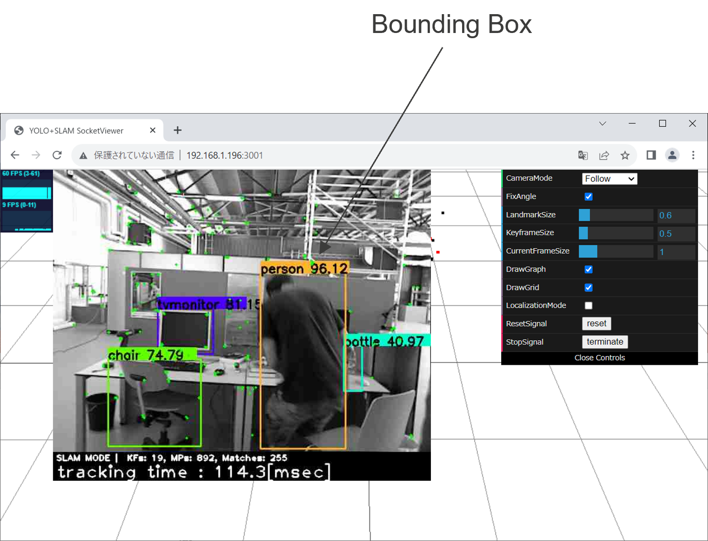
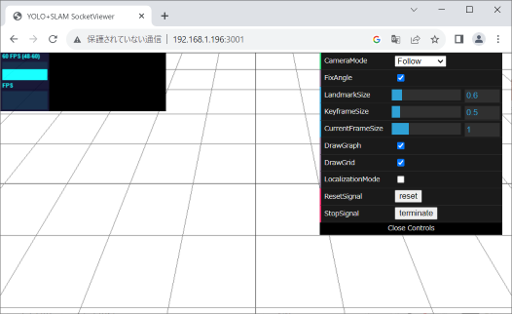

# Install guide

The target of this install guide is to run the AI-VSLAM application on the RZ / V2H EVK board and understand the application behavior and processing performance.

Before running this application, it is necessary to calibrate the camera according to "SoCDD-08571-01_RZV2H_USBcamera_Calibration".
If you do not calibrate your camera, the accuracy may be reduced.

## Requirements
### Deliverables

Refer the link below
[Download Link](https://www.renesas.com/us/en/software-tool/rzv2h-ai-software-development-kit)


Provided items from Renesas are listed below

#### RZ/V2H AI SDK
| Category | File name | Download site / Description |
| ---- | ---- | ---- |
| RZ/V2H AI SDK Source Code | RTK0EF0180F05200SJ_linux-src.zip | https://www.renesas.com/en/document/sws/rzv2h-ai-sdk-v520-source-code|
|   |  - README.txt | README file. | 
|   |  - rzv2h_ai-sdk_yocto_recipe_v5.20.tar.gz | Yocto recipe.<br> Yocto recipes are text files that contains necessary information to build Yocto Linux.|
|   |  - oss_pkg_rzv_v5.20.7z | OSS package.<br> OSS package is a set of open-source software source code used when building Yocto Linux. |
| RZ/V2H AI SDK | RTK0EF0180F05200SJ.zip | https://www.renesas.com/en/document/sws/rzv2h-ai-sdk-v520 |
|   |  - Dockerfile | Dockerfile for cross compile envirement | 
|   |  - DRP-AI_Translator_i8-v1.00-Linux-x86_64-Install | AI Translator installer|

### EVALUATION ENVIRONMENT

Equipment and Software Necessary for Developing Environments as follows.

| Equipment | Description |
| ---- | ---- |
| Target Board | RZ/V2H EVK |
| Linux host PC | Build embedded Linux, Create microSD Card.<br><span style="color: red;">__Ubuntu version 20.04 LTS (64 bit OS must be used.)__</span><br>&emsp; - 100GB free space on HDD is necessary.<br>Recommended memory size<br>&emsp; - DDR memory 16GB and SWAP 32GB<br>&emsp; - DDR memory 32GB and SWAP 16GB<br>&emsp; - DDR memory 48GB and SWAP 2GB<br> |
| Windows host PC | Communicate Target Board with terminal software.<br>Windows 10 is recommended. |
| Terminal software | Used for controlling serial console of the target board<br>Tera Term (latest version) is recommended<br>Available at https://ttssh2.osdn.jp/index.html.en |
| VCP Driver | Virtual COM Port driver which enables to communicate<br>Windows Host PC and the target board via USB<br>which is virtually used as serial port. <br>Available at: http://www.ftdichip.com/Drivers/VCP.htm<br>Please install VCP Driver corresponding to the target board. |
| Broadband router | DHCP server |
| SD Card | <span style="color: red;">__32GB or more.__</span> Store Kernel image, device tree, rootfs |
| USB camera | ELP-USBGS720P02-L36<br>(Camera is not required when using Datasets.) |
| USB power supply | Power supply |
| USB Cable micro-B | Connect Win PC and Target board |
| USB Cable Type-C | Connect AC adapter and Target board<br><span style="color: red;">__The board will not power on if the cable is less than 100W.__</span> |


 
### ALL FLOW of building AI-SLAM

Build an AI-SLAM application in the following order.<br>
- [STEP-1 Build Linux Environment](#step1)
- [STEP-2 Prepare a micro SD card to boot Linux](#step2)
- [STEP-3 Execute DRP-AI sample application](#step3)

If calibrate the USB camera, please refer to the [Calibration guide](calibrationguide.md). <br>


<br>

<a id="step1"></a>

## [STEP-1]<br>Build Linux Environment<br>

  - (1) [Download RZ/V2H AI SDK Source Code](#step1-1)
  - (2) [Deploy the files of RZ/V2H AI SDK and vslam](#step1-2)
  - (3) [Install the tools for building](#step1-3)
  - (4) [Extract Yocto recipe and ai-vslam package](#step1-4)
  - (5) [Initialize a build using the 'oe-init-build-env' script in Poky](#step1-5)
  - (6) [Add layer Graphics Library, drpai, opencva, etc.](#step1-6)
  - (7) [Change the size of the microSD card image in WIC format](#step1-7)
  - (8) [Bitbake the Image after extracting the OSS package](#step1-8)
  - (9) [Add SLAM recipe](#step1-9)
  - (10) [Bitbake the Image](#step1-10)
  - (11) [Build the target SDK](#step1-11)
  - (12) [Setup SDK in Docker](#step1-12)
  - (13) [CMake/Make application (Yolo-planar-slam)](#step1-13)
  - (14) [CMake/Make application (Stella-vslam)](#step1-14)

<a id="step2"></a>

## [STEP-2] <br>Prepare a micro SD card to boot Linux<br>
  
  - (15) [Prepare microSD Card](#step2-1)
  - (16) [Write image to microSD](#step2-2)
  - (17) [Write SLAM Script/Dataset/Application](#step2-3)

<a id="step3"></a>

## [STEP-3] <br>Execute DRP-AI sample application<br>

  - (18) [Start EVK board and VSLAM application](#step3-1)
  - (19) [Execute Yolo-planar-slam](#step3-2) 
  - (20) [Re-build AI-VSLAM application](#step3-3)
  - (21) [Execute Stella-vslam](#step3-4)
  - (22) [Re-build AI-VSLAM application](#step3-5)

## 1. Build Linux Environment
  
<a id="step1-1"></a>

###  (1) Download RZ/V2H AI SDK Source Code
  - [Downroad Link](https://www.renesas.com/en/document/sws/rzv2h-ai-sdk-v520-source-code).
  - Source Code：RTK0EF0180F05200SJ_linux-src.zip

<a id="step1-2"></a>

### (2) Deploy the files of RZ/V2H AI SDK and vslam.

  Create a working directory(${WORK}/src_setup) at Linux Host PC and deploy these files in your work directory.
  - Linux BSP   : RTK0EF0180F05200SJ_linux-src.zip 
  - AI SLAM application and recipe		: yolo-planar-slam-drp 
  
  Please deploy these file as follows. The name and the place of the working directory can be changed as necessary.

  Run the following commands on your Linux PC.
  ```
  export WORK="<working directory>"
  mkdir -p ${WORK}/src_setup
  cd ${WORK}/src_setup
  unzip RTK0EF0180F05200SJ_linux-src.zip -d ${WORK}/src_setup
  ls -1 ${WORK}/src_setup
  >>> README.txt
      rzv2h_ai-sdk_yocto_recipe_v5.20.tar.gz
      oss_pkg_rzv_v5.20.7z
  ```
  
  ```
  cd ${WORK}/src_setup
  git clone https://github.com/ComputermindCorp/yolo-planar-slam-drp.git
  ```

<a id="step1-3"></a>

### (3)-1 Install the tools for building.
  
  To install necessary software, run the following commands on your Linux PC.
  
  ```
  sudo apt-get update
  sudo apt-get install gawk wget git-core diffstat unzip texinfo gcc-multilib build-essential chrpath socat cpio python python3 python3-pip python3-pexpect xz-utils debianutils iputils-ping libsdl1.2-dev xterm p7zip-full libyaml-dev libssl-dev   
  ```

### (3)-2 Set the user name and email address before starting the build procedure. 

  Before starting the build, run the command below on the Linux Host PC to install packages used for building the BSP. <br>After that, Set git config (if it is NOT set).

  ```
  sudo apt-get update 
  sudo apt-get install gawk wget git-core diffstat unzip texinfo gcc-multilib build-essential chrpath socat cpio python python3 python3-pip python3-pexpect xz-utils debianutils iputils-ping libsdl1.2-dev xterm p7zip-full libyaml-dev libssl-dev 
  git config --global user.email “you@example.com”
  git config --global user.name “Your Name”
  ```

<a id="step1-4"></a>

### (4)-1 Extract Yocto recipe package.<br>
  Run the following commands on your Linux PC.
  ```
  export YOCTO_WORK=${WORK}/src_setup/yocto
  mkdir -p ${YOCTO_WORK}
  cd ${YOCTO_WORK}
  tar zxvf ${WORK}/src_setup/rzv2h_ai-sdk_yocto_recipe_v5.20.tar.gz
  ls -1 ${YOCTO_WORK}
  >>> 0001-tesseract.patch
      meta-gplv2
      meta-openembedded
      meta-renesas
      meta-rz-features
      meta-virtualization
      poky
  ```
  
### (4)-2 Extract ai-vslam package.<br>
  Run the following commands on your Linux PC.
  ```
  cd ${WORK}/src_setup/yolo-planar-slam-drp/src_files
  cat yolo-planar-slam_* > yolo-planar-slam.tar.gz
  cd ${YOCTO_WORK}  
  tar zxvf ${WORK}/src_setup/yolo-planar-slam-drp/src_files/meta-stella-vslam.tar.gz
  tar zxvf ${WORK}/src_setup/yolo-planar-slam-drp/src_files/stella_vslam_recursive.tar.gz
  tar zxvf ${WORK}/src_setup/yolo-planar-slam-drp/src_files/yolo-planar-slam.tar.gz  
  tar zxvf ${WORK}/src_setup/yolo-planar-slam-drp/src_files/yocto_ai_slam_guide.tar.gz  
  tar zxvf ${WORK}/src_setup/yolo-planar-slam-drp/src_files/stella_vslam_examples.tar.gz
  ```
  
### (4)-3 Update configuration code of yolo-planar-slam. 
  
  Run the following commands on your Linux PC.
  ```
  cp -r stella_vslam_examples/configuration_code yolo-planar-slam
  ```

<a id="step1-5"></a>

### (5) Initialize a build using the 'oe-init-build-env' script in Poky. 
  
  Run the following commands on your Linux PC.
  ```
  cd ${YOCTO_WORK}
  TEMPLATECONF=${PWD}/meta-renesas/meta-rzv2h/docs/template/conf/ source poky/oe-init-build-env
  ```

<a id="step1-6"></a>

### (6) Add layers of graphics Library, drpai, opencv accelerator, codecs and patch. 
  
  Run the following commands on your Linux PC.
  ```
  bitbake-layers add-layer ../meta-rz-features/meta-rz-graphics
  bitbake-layers add-layer ../meta-rz-features/meta-rz-drpai
  bitbake-layers add-layer ../meta-rz-features/meta-rz-opencva
  bitbake-layers add-layer ../meta-rz-features/meta-rz-codecs
  ```

  ```
  bitbake-layers add-layer ../meta-openembedded/meta-filesystems
  bitbake-layers add-layer ../meta-openembedded/meta-networking
  bitbake-layers add-layer ../meta-virtualization
  ```
  ※Note: It is different from AISDK.

  ```  
  patch -p1 < ../0001-tesseract.patch
  ```

<a id="step1-7"></a>

### (7) Change the size of the microSD card image in WIC format

  Run the following commands on your Linux PC.

  The case of using <span style="color: red;">__32GB__</span> microSD
  ```
  sed -i 's/1048576/16777216/g' conf/local.conf
  egrep 16777216 conf/local.conf
  >>> IMAGE_ROOTFS_EXTRA_SPACE = "16777216"
  ```

  The case of using <span style="color: red;">__16GB__</span> microSD
  ```
  sed -i 's/1048576/8388608/g' conf/local.conf
  egrep 8388608 conf/local.conf
  >>> IMAGE_ROOTFS_EXTRA_SPACE = "8388608"
  ```

<a id="step1-8"></a>

### (8) Bitbake the Image after extracting the OSS package
  ```
  cp ${WORK}/src_setup/oss_pkg_rzv_*.7z ${YOCTO_WORK}
  7z x ${YOCTO_WORK}/oss_pkg_rzv_*.7z -o${YOCTO_WORK}/build
  ls -1 ${YOCTO_WORK}/build
  >>> conf
      downloads
  ```

  Run the commands on your Linux PC below to start a build. Building an image can take up to a few hours depending on the user’s host system performance.
  ```
  cd ${YOCTO_WORK}/build
  MACHINE=rzv2h-evk-ver1 bitbake core-image-weston
  ```

<a id="step1-9"></a>

### (9) Add SLAM recipe 
  
  Run the following commands on your Linux PC.

  Initialize a build using the 'oe-init-build-env' script in Poky.
  ```
  cd ${YOCTO_WORK}
  TEMPLATECONF=${PWD}/meta-renesas/meta-rzv2h/docs/template/conf/ source poky/oe-init-build-env
  ```

  Add SLAM recipe.
  ```
  bitbake-layers add-layer ../meta-stella-vslam
  bitbake-layers show-layers | egrep stella
  >>> meta-stella-vslam<br>  {WORK}/src_setup/yocto/meta-stella-vslam  6  
  ```

  ```
  sed -i '$aWHITELIST_GPL-3.0 = " suitesparse-cxsparse suitesparse-config "' ./conf/local.conf
  ```

  ```
  egrep WHITELIST_GPL ./conf/local.conf
  >>> WHITELIST_GPL-3.0 = " suitesparse-cxsparse suitesparse-config "
  ```
  
<a id="step1-11"></a>

### (10) Build the target file system image using bitbake. 

  Run the following commands on your Linux PC.
  ```
  cd ${YOCTO_WORK}
  TEMPLATECONF=${PWD}/meta-renesas/meta-rzv2/docs/template/conf/ source poky/oe-init-build-env
  MACHINE=rzv2h-evk-ver1 bitbake core-image-weston 
  ```
  After completing the images for the target machine will be available in the output directory
  ‘<span style="color: blue;">__${YOCTO_WORK}/build/tmp/deploy/images/rzv2h-evk-ver1__</span>’.
  
  - <span style="color: red;">__core-image-weston-rzv2h-evk-ver1.wic.bmap__</span>
  - <span style="color: red;">__core-image-weston-rzv2h-evk-ver1.wic.gz__</span>
  
  
 > The bitbake may occur errors due to lack of memory.<br>
  *In that case, reduce the number of cores by adding the following command to local.conf. This is an example with 2 cores．<br>* 

  ```
  build/conf/local.conf<br>
  BB_NUMBER_THREADS = '2'<br>
  PARALLEL_MAKE = '-j 2'<br>
  ```

<a id="step1-12"></a>

### (11) Build the target SDK

  Run the following commands on your Linux PC.
  ```
  cd ${YOCTO_WORK}
  TEMPLATECONF=${PWD}/meta-renesas/meta-rzv2/docs/template/conf/ source poky/oe-init-build-env
  MACHINE=rzv2h-evk-ver1 bitbake core-image-weston -c populate_sdk
  ```

  The resulting SDK installer will be located in '<span style="color: blue;">__${YOCTO_WORK}/build/tmp/deploy/sdk'.__</span>
  
  - <span style="color: red;">__poky-glibc-x86_64-core-image-weston-aarch64-rzv2h-evk-ver1-toolchain-3.1.31.sh__</span> : Cross compiler installer

<a id="step1-13"></a>
### (12)-1 Register the working and setup directory path to an environment variable.
  
  Run the following commands on your Linux PC.
  ```
  export YOCTO_WORK=${WORK}/src_setup/yocto
  export AI_SDK_WORK=${WORK}/ai_sdk_work
  ```

### (12)-2  Copy the script of make*.sh to ${YOCTO_WORK}/script directory.

  Run the following commands on your Linux PC.

  ```
  cd ${YOCTO_WORK}
  mkdir -p script
  cp ${WORK}/src_setup/yolo-planar-slam-drp/setup_files/make*.sh ./script/
  ```

### (12)-3 Download RZ/V2H AI SDK and extract AI SDK.

  Refer the link below
  [Download Link.](https://www.renesas.com/en/document/sws/rzv2h-ai-sdk-v520)
  
  - RTK0EF0180F05200SJ.zip
  
  Run the following commands on your Linux PC.
  ```
  cd $WORK
  mkdir -p ai_sdk_work
  cd ${AI_SDK_WORK}
  unzip RTK0EF0180F05200SJ.zip
  ```

  ```
  cd ${AI_SDK_WORK}
  ls
  >>> ai_sdk_setup  board_setup  documents  r11an0840ej0520-rzv2h-ai-sdk.pdf  references
  ```
  
#### Make sure that you have installed Docker  on your Linux PC.

### (12)-4 Move to the working directory and change to Cross Compiler installer builded by this Guide.

  Run the following commands on your Linux PC.

  ```
  cd ${AI_SDK_WORK}/ai_sdk_setup
  mv poky-glibc-x86_64-core-image-weston-aarch64-rzv2h-evk-ver1-toolchain-3.1.31.sh poky-glibc-x86_64-core-image-weston-aarch64-rzv2h-evk-ver1-toolchain-3.1.31.sh.org 
  cp ${YOCTO_WORK}/build/tmp/deploy/sdk/poky-glibc-x86_64-core-image-weston-aarch64-rzv2h-evk-ver1-toolchain-3.1.31.sh .
  ```

### (12)-5 Build docker image and check docker images. 
  
  ```
  docker build -t rzv2h_ai_sdk_image:slam_2.12.3 --build-arg SDK="/opt/poky/3.1.31" --build-arg PRODUCT="V2H" .
  docker images
  ```
  
  |REPOSITORY|TAG|IMAGE ID|CREATED|SIZE|
  |----|----|----|----|----|
  |rzv2h_ai_sdk_image|slam_2.12.3|xxxxxxxxxxxx|About a minute ago| 25.2GB|
  
### (12)-6 Create docker container.
  ```
  cd ${AI_SDK_WORK}/ai_sdk_setup
  docker run -it --name rzv2h_ai_sdk_container_slam_2.12.3 -v ${YOCTO_WORK}:/drp-ai_tvm/yocto rzv2h_ai_sdk_image:slam_2.12.3
  ```  
  
  In docker container, run the following command to copy libtvm_runtime.so, which is the necessary file for the board and Cross Compiler environment. 
  
### (12)-7 Run the following commands <span style="color: red;"> __in  docker container__ </span>
    ```
    export YOCTO_WORK="/drp-ai_tvm/yocto"
    cp /drp-ai_tvm/obj/build_runtime/V2H/libtvm_runtime.so ${YOCTO_WORK:?}
    cp /drp-ai_tvm/obj/build_runtime/V2H/libtvm_runtime.so /opt/poky/3.1.31/sysroots/aarch64-poky-linux/usr/lib64
    exit
    ```

<a id="step1-14"></a>

## Make Yolo-planar-slam

### In case of using TVM version skip (14-a).

- (13-a)<span style="color: red;"> __yolo-planar-slam__</span> using <span style="color: red;">__AI translator__</span>
  
### (13-a)-1 Start docker container. 

  Run the following commands on your Linux PC.
  ```
  cd ${AI_SDK_WORK}/ai_sdk_setup

  docker start -i rzv2h_ai_sdk_container_slam_2.12.3
  ```
  
### (13-a)-2 Setup the environment for building application. 

  Run the following commands <span style="color: red;"> __in docker container__ </span>
  ```
  export YOCTO_WORK="/drp-ai_tvm/yocto"
  cd ${YOCTO_WORK:?}/yolo-planar-slam
  
  source /opt/poky/3.1.31/environment-setup-aarch64-poky-linux
  source script/setup.sh
  ```
  
### (13-a)-3Make yolo-planar-slam using AI translator. 

  Run the following commands <span style="color: red;"> __in docker container__  </span>
  ```
  mkdir build
  cd build
  ```
  
  Change the make script depending on the DRP library. 
  
  OpenCVA or CPU : 
  ```
  cp ../../script/make_yolo-planar-slam-oca-trn.sh .
  ./make_yolo-planar-slam-oca-trn.sh
  ```

  Custom:  
  ```
  cp ../../script/make_yolo-planar-slam-cus-trn.sh .
  ./make_yolo-planar-slam-cus-trn.sh
  ```

  ```
  exit
  ```
  ***In case of OpenCVA or CPU***

  Options of make_yolo-planar-slam-oca-trn.sh
  
  ```
  -DENABLE_SLAMFAST=OFF 
  ```

  ***In case of Custom***

  Options of make_yolo-planar-slam-cus-trn.sh

  ```
  -DENABLE_SLAMFAST=ON 
  ```

### In case of using AI translator version skip (14-b).
- (13-b) <span style="color: red;">__yolo-planar-slam__</span> using <span style="color: red;">__TVM__</span> 

### (13-b)-1 Start docker container. 

  Run the following commands on your Linux PC.
  ```
  cd ${AI_SDK_WORK}/ai_sdk_setup
  docker start -i rzv2h_ai_sdk_container_slam_2.12.3
  ```

### (13-b)-2 Setup the environment for building application. 

  Run the following commands <span style="color: red;"> __in docker container__ </span>
  ```
  export YOCTO_WORK="/drp-ai_tvm/yocto"
  cd ${YOCTO_WORK:?}/yolo-planar-slam
  
  source /opt/poky/3.1.31/environment-setup-aarch64-poky-linux
  source script/setup.sh
  ```

### (13-b)-3 Add the include directories of TVM to the CMakeLists.txt. 

  Run the following commands <span style="color: red;"> __in docker container__ </span>
  ```
  cat << 'EOS' | sed -i '121r /dev/stdin' ./CMakeLists.txt
  >>> set(TVM_ROOT $ENV{TVM_HOME})
      include_directories(
      ${TVM_ROOT}/include
      ${TVM_ROOT}/3rdparty/dlpack/include
      ${TVM_ROOT}/3rdparty/dmlc-core/include
      ${TVM_ROOT}/3rdparty/compiler-rt
      )
  
      EOS
  ```

### (13-b)-4 Check the CMakeLists.txt. 
  
  Run the following commands <span style="color: red;"> __in docker container__ </span>
  ```
  egrep -A 8 -B 3 TVM_HOME CMakeLists.txt

  >>> find_package(realsense2 REQUIRED)
      endif()
  
      set(TVM_ROOT `$ENV{TVM_HOME})
      include_directories(
      ${TVM_ROOT}/include
      ${TVM_ROOT}/3rdparty/dlpack/include
      ${TVM_ROOT}/3rdparty/dmlc-core/include
      ${TVM_ROOT}/3rdparty/compiler-rt
      )
  
      include_directories(
  ```

### (13-b)-5 Make yolo-planar-slam using TVM.  
  
  Run the following commands <span style="color: red;">__in docker container__ </span>
  ```
  mkdir build
  cd build
  ```

  Change the make script depending on the DRP library. 
  
  OpenCVA or CPU :
  ```
  cp ../../script/make_yolo-planar-slam-oca-tvm.sh .
  ./make_yolo-planar-slam-oca-tvm.sh
  ```

  Custom :
  ```
  cp ../../script/make_yolo-planar-slam-cus-tvm.sh  .
  ./make_yolo-planar-slam-cus-tvm.sh 
  ```

  ```
  exit
  ```

<a id="step1-15"></a>

## Make Stella-vslam

### (14) Make stella_vslam using TVM. 

### (14)-1 Start docker container. 

  Run the following commands on your Linux PC.
  ```
  cd ${AI_SDK_WORK}/ai_sdk_setup
  docker start -i rzv2h_ai_sdk_container_slam_2.12.3
  ```

### (14)-2 Setup the environment for building application. 

  Run the following commands <span style="color: red;"> __in docker container__ </span>
  ```
  export YOCTO_WORK="/drp-ai_tvm/yocto"
  cd ${YOCTO_WORK:?}/stella_vslam

  source /opt/poky/3.1.31/environment-setup-aarch64-poky-linux
  source scripts/setup.sh
  ```

### (14)-3 Make a local directory. 

  Run the following commands <span style="color: red;"> __in docker container__ </span>
  ```
  export CMAKE_INSTALL_PREFIX=${YOCTO_WORK:?}/local
  mkdir -p ${CMAKE_INSTALL_PREFIX:?}
  ```

### (14)-4 Clone the repository of g2o. 

  Run the following commands <span style="color: red;"> __in docker container__ </span>
  ```
  cd ${YOCTO_WORK:?}
  
  export G2O_COMMIT=20230223_git
  git clone https://github.com/RainerKuemmerle/g2o.git
  cd g2o
  git checkout ${G2O_COMMIT}
  ```

### (14)-5 Build g2o and independent of OpenGL and then install. 

  Run the following commands <span style="color: red;"> __in docker container__ </span>
  ```
  mkdir -p build
  cd ./build
  cp ../../script/make_g2o.sh .
  ./make_g2o.sh
  
  cd ${YOCTO_WORK:?}/g2o/build
  sed -i 's/find_dependency(OpenGL)/# find_dependency(OpenGL)/g' generated/g2oConfig.cmake
  
  make install
  ```

### (14)-6 Register as safe directories. 

  Run the following commands <span style="color: red;"> __in docker container__ </span>
  ```
  cd ${YOCTO_WORK:?}/stella_vslam  
  git config --global --add safe.directory /drp-ai_tvm/yocto/stella_vslam
  git config --global --add safe.directory /drp-ai_tvm/yocto/stella_vslam/3rd/FBoW
  git config --global --add safe.directory /drp-ai_tvm/yocto/stella_vslam/3rd/tinycolormap
  git config --global --add safe.directory /drp-ai_tvm/yocto/stella_vslam/drp_cv_lib  
  git submodule update --init
  ```

### (14)-7 Add the include directories of TVM to the CMakeLists.txt. 

  Run the following commands <span style="color: red;"> __in docker container__ </span>
  ```
  cat << 'EOS' | sed -i '160r /dev/stdin' ./CMakeLists.txt
  >>> set(TVM_ROOT $ENV{TVM_HOME})
      include_directories(
      ${TVM_ROOT}/include
      ${TVM_ROOT}/3rdparty/dlpack/include
      ${TVM_ROOT}/3rdparty/dmlc-core/include
      ${TVM_ROOT}/3rdparty/compiler-rt
      )
  
      EOS
  ```

### (14)-8 Check the CMakeLists.txt. 

  Run the following commands <span style="color: red;"> __in docker container__ </span>
  ```
  egrep -A 8 -B 3 TVM_HOME CMakeLists.txt

  >>> set(ARCHIVE_DESTINATION lib)
      set(INCLUDES_DESTINATION include)
  
      set(TVM_ROOT $ENV{TVM_HOME})
      include_directories(
      ${TVM_ROOT}/include
      ${TVM_ROOT}/3rdparty/dlpack/include
      ${TVM_ROOT}/3rdparty/dmlc-core/include
      ${TVM_ROOT}/3rdparty/compiler-rt
      )
  
      ----- Build -----
  ```

### (14)-9 Build stella_vslam and install. 
  
  Run the following commands <span style="color: red;">__in docker container__</span>
  ```
  mkdir -p build
  cd ./build
  cp ../../script/make_stella-slam-tvm.sh .
  ./make_stella-slam-tvm.sh
  
  make install
  ```

### (14)-10 Clone the repository of socket_publisher. 
  
  Run the following commands <span style="color: red;">__in docker container__</span>
  ```
  cd ${YOCTO_WORK:?}
  
  git clone https://github.com/stella-cv/socket_publisher.git -b 0.0.1
  
  cd ${YOCTO_WORK:?}/socket_publisher
  ```

### (14)-11 Add "SIOCLIENT_LIBRARY" to CMakeLists.txt. 
  
  Run the following commands <span style="color: red;"> __in docker container__ </span>
  ```
  sed -i 's/find_package(sioclient REQUIRED)/find_package(sioclient REQUIRED)\n# Change SIOCLIENT_LIBRARY for BitBake\nset(SIOCLIENT_LIBRARY "sioclient")\n/g' CMakeLists.txt
  ```
  
### (14)-12 Add the include directories of EIGEN3 and OpenCV to the CMakeLists.txt. 

  Run the following commands <span style="color: red;">__in docker container__</span>
  ```
  cat << 'EOS' | sed -i '61r /dev/stdin' ./CMakeLists.txt
  >>> find_package(Eigen3 REQUIRED)
      include_directories(${EIGEN3_INCLUDE_DIR})
  
      find_package(OpenCV REQUIRED)
      include_directories(${OpenCV_INCLUDE_DIRS})
  
      EOS
  ```

### (14)-13 Check the CMakeLists.txt. 
  
  Run the following commands <span style="color: red;">__in docker container__ </span>
  ```
  egrep -A 8 -B 3 "Eigen3" CMakeLists.txt

  >>> PRIVATE 
      "$ <BUILD_INTERFACE:${CMAKE_CURRENT_BINARY_DIR}>")

      find_package(Eigen3 REQUIRED)
      include_directories(${EIGEN3_INCLUDE_DIR})
  
      find_package(OpenCV REQUIRED)
      include_directories(${OpenCV_INCLUDE_DIRS})
  
      target_link_libraries(socket_publisher
          PUBLIC
          stella_vslam::stella_vslam
  ```

### (14)-14 Build socket_publisher and install. 
  
  Run the following commands <span style="color: red;">__in docker container__</span>
  ```
  mkdir -p build
  cd build
  cp ../../script/make_socket_publisher.sh .
  ./make_socket_publisher.sh
  
  make install
  ```

### (14)-15 Register as safe directories. 

  Run the following commands <span style="color: red;">__in docker container__</span>
  ```
  cd ${YOCTO_WORK:?}/stella_vslam_examples
  
  git config --global --add safe.directory /drp-ai_tvm/yocto/stella_vslam_examples

  git config --global --add safe.directory /drp-ai_tvm/yocto/stella_vslam_examples/3rd/filesystem
  
  git submodule update --init
  ```

### (14)-16 Add the include directories of TVM and EIGEN3 and OpenCV to the CMakeLists.txt. 

  Run the following commands <span style="color: red;">__in docker container__</span>
  ```
  cat << 'EOS' | sed -i '17r /dev/stdin' ./CMakeLists.txt
  >>> set(TVM_ROOT $ENV{TVM_HOME})
      include_directories(
      ${TVM_ROOT}/include
      ${TVM_ROOT}/3rdparty/dlpack/include
      ${TVM_ROOT}/3rdparty/dmlc-core/include
      ${TVM_ROOT}/3rdparty/compiler-rt
      )
  
      find_package(Eigen3 REQUIRED)
      include_directories(${EIGEN3_INCLUDE_DIR})
  
      find_package(OpenCV REQUIRED)
      include_directories(${OpenCV_INCLUDE_DIRS})
  
      EOS
  ```

### (14)-17 Check the CMakeLists.txt. 
  
  Run the following commands <span style="color: red;"> __in docker container__ </span>
  ```
  egrep -A 14 -B 2 TVM_HOME CMakeLists.txt
  
  >>> endif()
  
      set(TVM_ROOT $ENV{TVM_HOME})
      include_directories(
      ${TVM_ROOT}/include
      ${TVM_ROOT}/3rdparty/dlpack/include
      ${TVM_ROOT}/3rdparty/dmlc-core/include  
      ${TVM_ROOT}/3rdparty/compiler-rt
      )
  
      find_package(Eigen3 REQUIRED)
      include_directories(${EIGEN3_INCLUDE_DIR})
  
      find_package(OpenCV REQUIRED)
      include_directories(${OpenCV_INCLUDE_DIRS})
  
      filesystem
  ```

### (14)-18 Build stella-slam-examples. 

   Run the following commands <span style="color: red;">__in docker container__</span>

    ```
    mkdir -p build
    cd build
    cp ../../script/make_stella-slam-examples-tvm.sh .
    ./make_stella-slam-examples-tvm.sh
    ```

### (14)-19 Install curl and download the orb_vocab.fbow. 

  Run the following commands <span style="color: red;">__in docker container__</span>
  ```
  apt update
  apt install curl
  ```

  ```
  cd ${YOCTO_WORK:?}/stella_vslam_examples
  curl -sL "https://github.com/stella-cv/FBoW_orb_vocab/raw/main/orb_vocab.fbow" -o orb_vocab.fbow
  ```

  ```
  ls
  >>> 3rd  CMakeLists.txt  LICENSE  README.md  build  build.sh  configuration_code  orb_vocab.fbow  scripts  src
  ```
  
  ```
  exit
  ```

## 2. Prepare microSD card to boot Linux
  

<a id="step2-1"></a>

### (15) Prepare a microSD Card 
        
  To boot from microSD Card, over <span style="color: red;">__32GB__ </span >capacity of blank microSD card is needed, Please use Linux Host PC to write image data using USB card reader or other equipment.<br>
  Please write image data to your microSD Card according to the following steps.

<a id="step2-2"></a>

### (16)-1 Install Necessary Software  
  
  Run the following commands on your Linux PC.
  ```
  sudo apt install bmap-tools
  ```

### (16)-2 Write image to microSD card 
  
  Here, we use "<span style="color: red;">__/dev/sdc__</span>" as microSD card device name.<br>
  <span style="color: red;">__"/dev/sdc" needs to be changed according to your environment of Ubuntu PC.__</span>
  
### (16)-3 Write the image file to microSD 
  
  Run the following commands on your Linux PC.
  ```
  cd ${YOCTO_WORK}/build/tmp/deploy/images/rzv2h-evk-ver1/
  sudo bmaptool copy --bmap core-image-weston-rzv2h-evk-ver1.wic.bmap core-image-weston-rzv2h-evk-ver1.wic.gz /dev/sdc
  ```

### (16)-4 Mount microSD Card. The name and the place of the mount directory can be changed as necessary. 
  
  Run the following commands on your Linux PC.
  ```
  export SD_VFAT="/media/<user-name>/3A98-31EA"
  export SD_EXT4="/media/<user-name>/rootfs"
  sudo mount -t vfat /dev/sdc1 $SD_VFAT
  sudo mount -t ext4 /dev/sdc2 $SD_EXT4
  ```

### (16)-5 Write libtvm_runtime.so to microSD 
  
  Run the following commands on your Linux PC. 
  ```
  sudo cp   ${YOCTO_WORK}/libtvm_runtime.so   ${SD_EXT4}/usr/lib64
  ```

<a id="step2-3"></a>

### (17)-1-0 Dataset 

  The dataset can be downloaded from the following site.
  Check the license etc.
  The method of download shows after the next.
  
  [TUM Dataset](https://cvg.cit.tum.de/data/datasets/rgbd-dataset/download)<br>
  fr3/walking_xyz<br>
  fr3/walking_halfsphere

  [EuRoC MAV Dataset](https://projects.asl.ethz.ch/datasets/doku.php?id=kmavvisualinertialdatasets)<br>
  vicon_room1/V1_01_easy
  
 ### This dataset used for Yolo-planar-slam, in case of using Stella-vslam skip (18)-1-1.
  
### (17)-1-1 downloading the dataset(TUM) and using the dataset. 

### (17)-1-1a Download Dataset(rgbd_dataset_freiburg3_walking_xyz.tgz) for Yolo-planar-slam. 
  
  Run the following commands on your Linux PC.
  ```
  cd ${WORK}
  mkdir -p dataset_yolo
  cd ${WORK}/dataset_yolo
  
  wget https://vision.in.tum.de/rgbd/dataset/freiburg3/rgbd_dataset_freiburg3_walking_xyz.tgz
  
  wget https://svncvpr.in.tum.de/cvpr-ros-pkg/trunk/rgbd_benchmark/rgbd_benchmark_tools/src/rgbd_benchmark_tools/associate.py
  ```

### (17)-1-1b Run associate.py to make associate.txt. 

  Run the following commands on your Linux PC.
  ```
  tar -zxvf rgbd_dataset_freiburg3_walking_xyz.tgz

  sync

  DATASET=rgbd_dataset_freiburg3_walking_xyz

  python2 associate.py ${DATASET}/rgb.txt ${DATASET}/depth.txt > associate.txt
  ```

### (17)-1-1c Convert rgbd_dataset_freiburg3_walking_xyz to make GRAY_rgbd_dataset_freiburg3_walking_xyz. 
  
  Run the following commands on your Linux PC.
  ```
  sudo apt install imagemagick
  cp -r rgbd_dataset_freiburg3_walking_xyz GRAY_rgbd_dataset_freiburg3_walking_xyz
  cd GRAY_rgbd_dataset_freiburg3_walking_xyz
  sed -i "s/rgb/gray/g" rgb.txt
  mkdir gray
  cd rgb
  find *.png | xargs -I {} convert {} -colorspace Gray ../gray/{}
  cd ../..
  ```

### (17)-1-1d Write Dataset files to the microSD 

  Run the following commands on your Linux PC.
  ```
  sudo mkdir -p $SD_EXT4/opt/dataset/tum
  sudo cp -r rgbd_dataset_freiburg3_walking_xyz ${SD_EXT4}/opt/dataset/tum/
  sync
  
  sudo cp associate.txt ${SD_EXT4}/opt/dataset/tum/rgbd_dataset_freiburg3_walking_xyz
  sudo cp -r GRAY_rgbd_dataset_freiburg3_walking_xyz ${SD_EXT4}/opt/dataset/tum/
  
  sync
  ```

### This dataset used for Stella-vslam, in case of using Yolo-planar-slam skip (18)-1-2.

### (17)-1-2 downloading dataset(TUM,EuRoC) and using the dataset.  

### (17)-1-2a Download Dataset(rgbd_dataset_freiburg3_walking_xyz.tgz, V1_01_easy.zip) for Stella-vslam. 
  
  Run the following commands on your Linux PC.
  ```
  cd ${WORK}
  mkdir -p dataset_stella
  cd ${WORK}/dataset_stella
  wget https://vision.in.tum.de/rgbd/dataset/freiburg3/rgbd_dataset_freiburg3_walking_halfsphere.tgz 
  
  wget https://svncvpr.in.tum.de/cvpr-ros-pkg/trunk/rgbd_benchmark/rgbd_benchmark_tools/src/rgbd_benchmark_tools/associate.py
  
  wget http://robotics.ethz.ch/~asl-datasets/ijrr_euroc_mav_dataset/vicon_room1/V1_01_easy/V1_01_easy.zip
  ```

### (17)-1-2b Run associate.py to make associate.txt. 
  
  Run the following commands on your Linux PC.
  ```
  tar xzvf rgbd_dataset_freiburg3_walking_halfsphere.tgz
  sync
  DATASET=rgbd_dataset_freiburg3_walking_halfsphere
  python2 associate.py ${DATASET}/rgb.txt ${DATASET}/depth.txt > associate.txt
  ```

### (17)-1-2c Write Dataset files to the microSD 
  
  Run the following commands on your Linux PC.
  ```
  sudo cp -r rgbd_dataset_freiburg3_walking_halfsphere ${SD_EXT4}/opt/dataset/tum/
  
  sync
  
  sudo cp associate.txt ${SD_EXT4}/opt/dataset/tum/rgbd_dataset_freiburg3_walking_halfsphere
  
  sudo mkdir -p ${SD_EXT4}/opt/dataset/V1_01_easy
  sudo unzip V1_01_easy.zip -d ${SD_EXT4}/opt/dataset/V1_01_easy
  
  sync
  ```

### (17)-2 Write files to the microSD 
  
  Yolo-planar-slam execution file and viewer and so on<br>
  Run the following commands on your Linux PC.
  ```
  cd ${YOCTO_WORK:?}/yolo-planar-slam
  
  sudo mkdir -p ${SD_EXT4}/home/root/yolo-planar-slam
  
  tar zxvf Vocabulary/ORBvoc.txt.tar.gz -C Vocabulary
  
  tar zxvf ${WORK}/src_setup/yolo-planar-slam-drp/setup_files/YOLOX_S_dense_640x640_RGB_10271351.tar.gz
  cp ${WORK}/src_setup/yolo-planar-slam-drp/setup_files/run_*planar*.sh script/
  
  tar zxvf ${WORK}/src_setup/yolo-planar-slam-drp/setup_files/app_yolox-S_bgr640x640_20240902.tar.gz app_yolox-S_bgr640x640/yolox_cam
  
  sync
  
  sudo cp -r YOLOX_S_dense_640x640_RGB_10271351 Vocabulary/ configuration_code/ Examples/ viewer/ script/ build/ lib/ Thirdparty/ 
  app_yolox-S_bgr640x640/yolox_cam/ ${SD_EXT4}/home/root/yolo-planar-slam
  
  sync
  ```

### (17)-3 Write files to the card 
  
  Stella_vslam execution file and viewer and so on<br>
  Run the following commands on your Linux PC.
  ```
  cd ${YOCTO_WORK:?}/stella_vslam
  
  sudo mkdir -p  ${SD_EXT4}/home/root/stella_vslam
  sudo cp -r ./example  ${SD_EXT4}/home/root/stella_vslam
  
  cd ${YOCTO_WORK:?}/stella_vslam_examples
  mkdir -p script
  cp ${WORK}/src_setup/yolo-planar-slam-drp/setup_files/run_*stella*.sh script/
  
  tar zxvf ${WORK}/src_setup/yolo-planar-slam-drp/setup_files/app_yolox-S_bgr640x640_20240902.tar.gz app_yolox-S_bgr640x640/yolox_cam
  
  sudo mkdir -p ${SD_EXT4}/home/root/stella_vslam_examples/script
  sudo cp -r orb_vocab.fbow configuration_code build script app_yolox-S_bgr640x640/yolox_cam ${SD_EXT4}/home/root/stella_vslam_examples
  
  sync
  ```

### (17)-4 Make eval directory 

  Run the following commands on your Linux PC.
  ```
  sudo mkdir -p ${SD_EXT4}/home/root/stella_vslam_examples/eval
  ```

### (17)-5 Write files to the card 
  
  Viewer for Stella-vslam<br>
  Run the following commands on your Linux PC.
  ```
  cd ${YOCTO_WORK:?}
  
  git clone https://github.com/stella-cv/socket_viewer
  cd socket_viewer
  git checkout e1e14ee
  
  cd ${YOCTO_WORK:?}
  sudo mkdir -p ${SD_EXT4}/home/root/socket_viewer
  sudo cp -r ./socket_viewer/* ${SD_EXT4}/home/root/socket_viewer
  sudo mkdir -p                       ${SD_EXT4}/home/root/local
  sudo cp -r ./local/lib              ${SD_EXT4}/home/root/local
  sync
  ```

### (17)-6 Unmount microSD Card 
  
  Run the following commands on your Linux PC.
  ```
  sudo umount $SD_VFAT
  sudo umount $SD_EXT4
  ```

## 3. Execute AI-VSLAM Sample Application


### Start board
  

<a id="step3-1"></a>

### (18)-1 Power OFF(SW2:OFF, SW3:OFF)  
### (18)-2 Connect equipment (see right the figure) 
### (18)-3 Change DSw1 and DSW2 setting as shown in the figure. <br>
         Attach microSD Card 
### (18)-4 Turn the SW3 ON. 
### (18)-5 Turn the SW2 ON. 
### (18)-6 After the Boot-up, open terminal app. 

   Terminal app setting
   - speed	: 115200bps
   - data 	: 8bit
   - Parity	: None
   - Stop bit        	: 1bit
   - Flow control 	: None

#### Shutdown RZ/V2H EVK
- To power-off the RZ/V2H EVK,　follow the procedures below.<br>
  1.Run the shutdown command on board console.
  ```
  shutdown -h now
  ```
  2.On board console, check that shutdown procedure runs and ends with following log.
  ```
  [xxxxx.xxxxxx] reboot: Power down
  ```
  3.Turn the SW2 OFF.<br>
  4.Turn the SW3 OFF.

#### Linux boot and Login
### (18)-7 Login as root <br>
  

#### Terminal with SSH
### (18)-8 Check the IP address of eth0(EVK) with ifconfig. 
  
  Run the following commands on board console.
  ```
  ifconfig
  >>> eth0 Link encap:Ethernet  HWaddr xx:xx:xx:xx:xx:xx<br>
           inet addr:192.xxx.xxx.xxx Bcast:xxx.xxx.xxx.xxx  Mask:xxx.xxx.xxx.xxx
  ```

### (18)-9 Open two Terminals of TeraTerm with SSH. (Term1,Term2) 

  User name: <span style="color: red;">__root__</span><br>
  Passphrase: <span style="color: red;">__(blank)__</span>
  

<a id="step3-2"></a>

### Run Yolo-planar-slam

#### Run viewer

### (19) - 1. Run viewer server with <span style="color: red;">__Term1.__</span>
  
  ```
  export HOME=/home/root
  cd $HOME/yolo-planar-slam/viewer
  node app.js
  ```

### (19)-2 The following message is displayed. (Term1) 

  ```
  WebSocket: listening on *:3000
  HTTP server: listening on *:3001
  ```

### (19)-3 Launch <span style="color: red;">__the browser on the PC side__</span> and input [IP address of smarc board(eth0 192.xxx.xxx.xxx)]: 3001 <br>
  

#### Execute AI-VSLAM

### (19)-4 Initialize and modify yaml file with <span style="color: red;">__Term2__</span>. 
  ```
  cd $HOME/yolo-planar-slam
  source ./script/run_setenv_planar_slam.sh
  ```

### (19)-5 Run the following program. (Term2) 
  ```
  ./script/run_planar_vslam.sh [1] [2] [3]
  ```
  <span style="color: red;">__For example,  MODE:Monocular/GRAY, SLAM:OpenCVA(DRP), Viewer:off__</span>
  ```
  ./script/run_planar_vslam.sh 1 1 0
  ```
  Select arguments [1] to [3] of the script from the following table.
  
  |[1]|[2]|[3]| --- |
  | ---- | ---- |---- | ---- |
  | MODE | SLAM | Viewer | Yolox-S|
  |0: Monocular : rgbd_dataset_freiburg3_walking_xyz<br>1: Monocular : GRAY_rgbd_dataset_freiburg3_walking_xyz<br>2: Monocular : ELP USB Camera <span style="color: red;">*1</span><br>3: RGB-D      : rgbd_dataset_freiburg3_walking_xyz| 0: CPU<span style="color: red;">*2</span><br>1: OpenCVA(DRP) <span style="color: red;">*2</span><br>2: Custom(DRP) <span style="color: red;">*3</span>| 0: OFF<br>1: ON | DRPAI fixed |

  *1. It is necessary to use parameters that have been calibrated for the camera.<br>Change "ELP_rns-2022-0901.yaml" to the calibrated parameters.  (Refer to SoCDD-08466-02_RZV2H_AI_VSLAM_InstallGuid.)<br>
  *2. It is necessary to build yolo-planar-slam with option "-DENABLE_SLAMFAST=OFF" of make_yolo-planar-slam-oca-xxx.sh.<br>
  *3. It is necessary to build yolo-planar-slam with option "-DENABLE_SLAMFAST=ON" of make_yolo-planar-slam-cus-xxx.sh.

#### Browser
### (19)-6 Browser 
   
   

#### Re-build and Transfer the application
**<span style="color: red;">Open new terminal.</span>**<br>
After editing software and build option, execute following command.

<a id="step3-3"></a>

### (20) Re-build AI-VSLAM application 
  
  Run the following commands on your Linux PC.
  ```
  export WORK="<working directory>"
  export YOCTO_WORK="${WORK}/src_setup/yocto"
  export AI_SDK_WORK="${WORK}/ai_sdk_work"
  cd ${AI_SDK_WORK}/ai_sdk_setup
  
  docker start -i rzv2h_ai_sdk_container_slam_2.12.3
  ```

  Run the following commands <span style="color: red;">__in docker container__</span>
  ```
  export YOCTO_WORK="/drp-ai_tvm/yocto"
  cd ${YOCTO_WORK}/yolo-planar-slam
  source /opt/poky/3.1.31/environment-setup-aarch64-poky-linux
  source script/setup.sh
  
  mkdir -p build
  cd build
  ```

  Change the make script depending on the DRP library.
  OpenCVA or CPU (using AI-Translator) :

  ```
  cp ../../script/make_yolo-planar-slam-oca-trn.sh .
  ./make_yolo-planar-slam-oca-trn.sh
  ```

  OpenCVA or CPU (using Translator) :
  ```
  cp ../../script/make_yolo-planar-slam-oca-tvm.sh .
  ./make_yolo-planar-slam-oca-tvm.sh
  ```

  Custom(using TVM):  
  ```
  cp ../../script/make_yolo-planar-slam-cus-trn.sh .
  ./make_yolo-planar-slam-cus-trn.sh
  ```

  Custom(using TVM):
  ```
  cp ../../script/make_yolo-planar-slam-cus-tvm.sh .
  ./make_yolo-planar-slam-cus-tvm.sh
  ```

  ```
  exit
  ```

  Check the IP address of eth0 (EVK)  and remove the old data (EVK).
  
  Run the following commands on board console.
  ```
  ifconfig
  >>> eth0 Link encap:Ethernet  HWaddr xx:xx:xx:xx:xx:xx<br>
           inet addr:192.xxx.xxx.xxx  Bcast:xxx.xxx.xxx.xxx  Mask:xxx.xxx.xxx.xxx
  ```
  
  ```
  export HOME=/home/root
  cd ${HOME}/yolo-planar-slam
  rm -r Examples build lib Thirdparty
  ```

  Copy the following directory to EVK.<br>
  Run the following commands on your Linux PC.

  ```
  cd ${YOCTO_WORK}/yolo-planar-slam

  scp -r Examples build lib Thirdparty root@192.xxx.xxx.xxx:/home/root/yolo-planar-slam
  ```

  Sync on EVK.<br>
  Run the following commands on board console.
  ```
  sync
  ```

<a id="step3-4"></a>

### Run Stella-vslam

### (21)-1 Run viewer server with <span style="color: red;">__Term1__</span>. 
  ```
  export HOME=/home/root
  cd $HOME/socket_viewer
  node app.js
  ```

### (21)-2 The following message is displayed. (Term1) 
  ```
  WebSocket: listening on *:3000
  HTTP server: listening on *:3001
  ```

### (21)-3 Launch <span style="color: red;">__the browser on the PC side__</span> and input [IP address of smarc board(eth0 192.xxx.xxx.xxx)]: 3001 <br>
  

#### Execute AI-VSLAM
### (21)-4 Initialize and modify yaml file with <span style="color: red;">__Term2__</span>. 
  ```
  cd $HOME/stella_vslam_examples
  source ./script/run_setenv_stella_slam.sh
  ```
### (21)-5 Run the following program. (Term2) 
  ```
  ./script/run_stella_vslam_examples.sh [1] [2] [3] [4]
  ```

  Select arguments [1] to [4] of the script from the following table.
  
  |[1]|[2]|[3]| [4] |
  | ---- | ---- |---- | ---- |
  | MODE | SLAM | Yolox-S | Viewer|
  |0: Monocular : rgbd_dataset_freiburg3_walking_halfsphere<br>1: Monocular : ELP USB Camera <span style="color: red;">*1</span><br>2: RGB-D      : rgbd_dataset_freiburg3_walking_halfsphere<br>3: Stereo       : V1_01_easy| 0: CPU<br>1: OpenCVA(DRP)<br>2: Custom(DRP)|0: ------ <span style="color: red;">*2</span><br>1: DRPAI| : OFF<br>1: ON|

  *1. It is necessary to use parameters that have been calibrated for the camera.<br>Change "ELP_rns-2022-0901.yaml" to the calibrated parameters.  (Refer to SoCDD-08466-02_RZV2H_AI_VSLAM_InstallGuid.)<br>
  *2. Yolox-s does not run on either the CPU or the DRPAI.

#### Browser
### (21)-6 Browser 
   
   

### Re-build and Transfer the application
**<span style="color: red;">Open new terminal.</span>**<br>
After editing software and build option, execute following command.
<a id="step3-5"></a>
### (22) Re-build AI-VSLAM application
  
  Run the following commands on your Linux PC.
  ```
  export WORK="<working directory>"
  export YOCTO_WORK="${WORK}/src_setup/yocto"
  export AI_SDK_WORK="${WORK}/ai_sdk_work"
  cd ${AI_SDK_WORK}/ai_sdk_setup
  
  docker start -i rzv2h_ai_sdk_container_slam_2.12.3
  ```
  
  Run the following commands <span style="color: red;">__in docker container__</span>
  ```
  export YOCTO_WORK="/drp-ai_tvm/yocto"
  cd ${YOCTO_WORK}/stella_vslam
  source /opt/poky/3.1.31/environment-setup-aarch64-poky-linux
  source scripts/setup.sh
  export CMAKE_INSTALL_PREFIX=${YOCTO_WORK:?}/local
  
  cd ${YOCTO_WORK}/stella_vslam
  mkdir -p build
  cd ./build
  cp ../../script/make_stella-slam-tvm.sh .
  ./make_stella-slam-tvm.sh
  make install
  
  cd ${YOCTO_WORK}/socket_publisher
  mkdir -p build
  cd build
  cp ../../script/make_socket_publisher.sh .
  ./make_socket_publisher.sh
  make install
  
  cd ${YOCTO_WORK}/stella_vslam_examples
  mkdir -p build
  cd build
  cp ../../script/make_stella-slam-examples-tvm.sh .
  ./make_stella-slam-examples-tvm.sh
  
  exit
  ```
  
  Check the IP address of eth0 (EVK)  and remove the old data (EVK).

  Run the following commands on board console.
  ```
  ifconfig
  >>> eth0 Link encap:Ethernet  HWaddr xx:xx:xx:xx:xx:xx<br>
           inet addr:192.xxx.xxx.xxx  Bcast:xxx.xxx.xxx.xxx  Mask:xxx.xxx.xxx.xxx
  ```
  
  ```
  export HOME=/home/root
  cd ${HOME}/stella_vslam
  rm -r example
  
  cd ${HOME}/stella_vslam_examples
  rm -r build
  
  cd ${HOME}/local
  rm -r lib
  ```

  Copy the following directory to EVK.<br>
  Run the following commands on your Linux PC.
  ```
  cd ${YOCTO_WORK}/stella_vslam
  scp -r example root@192.xxx.xxx.xxx:/home/root/stella_vslam
  sync
  ```

  Sync on EVK.<br>
  Run the following commands on board console.
  ```
  sync
  ```

  Run the following commands on your Linux PC.
  ```
  cd ${YOCTO_WORK}/stella_vslam_examples
  scp -r build root@192.xxx.xxx.xxx:/home/root/stella_vslam_examples
  sync
  ```

  Run the following commands on board console.
  ```
  sync
  ```

  Run the following commands on your Linux PC.
  ```
  cd ${YOCTO_WORK}/local
  scp -r lib root@192.xxx.xxx.xxx:/home/root/local
  sync
  ```

  Run the following commands on board console.
  ```
  sync
  ```